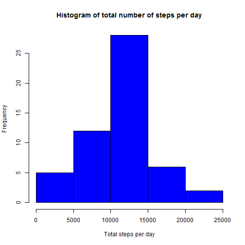
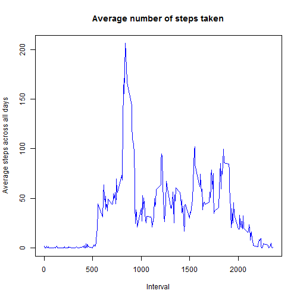
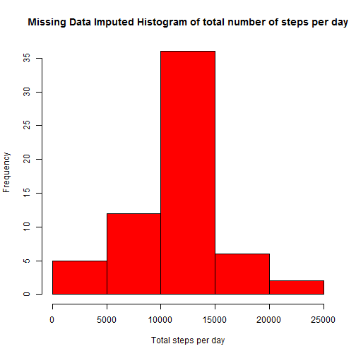
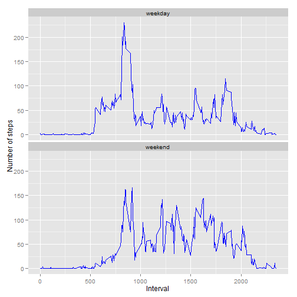

Environment Information
---


```r
        sessionInfo()
```

```
## R version 3.0.3 (2014-03-06)
## Platform: x86_64-w64-mingw32/x64 (64-bit)
## 
## locale:
## [1] LC_COLLATE=English_United Kingdom.1252 
## [2] LC_CTYPE=English_United Kingdom.1252   
## [3] LC_MONETARY=English_United Kingdom.1252
## [4] LC_NUMERIC=C                           
## [5] LC_TIME=English_United Kingdom.1252    
## 
## attached base packages:
## [1] stats     graphics  grDevices utils     datasets  methods   base     
## 
## other attached packages:
## [1] ggplot2_1.0.0  plyr_1.8.1     downloader_0.3 knitr_1.6     
## 
## loaded via a namespace (and not attached):
##  [1] colorspace_1.2-4 digest_0.6.4     evaluate_0.5.5   formatR_0.10    
##  [5] grid_3.0.3       gtable_0.1.2     htmltools_0.2.4  labeling_0.2    
##  [9] markdown_0.7.2   MASS_7.3-29      mime_0.1.2       munsell_0.4.2   
## [13] proto_0.3-10     Rcpp_0.11.1      reshape2_1.4     rmarkdown_0.2.49
## [17] scales_0.2.4     stringr_0.6.2    tools_3.0.3      yaml_2.1.11
```
              
Loading Required Libraries 
---


```r
        library(knitr)
        library(downloader)
        library(plyr)
        library(ggplot2)
```


Setting additional directories
---


```r
        if (!file.exists("rawData"))  {dir.create("rawData") }
```


Loading and preprocessing the data
---


```r
        if (!file.exists("activity.zip"))  
        { 
                 fileUrl <- "https://d396qusza40orc.cloudfront.net/repdata%2Fdata%2Factivity.zip" 
                 download(fileUrl,"activity.zip" ,mode="wb")
        }

        unzip("activity.zip",overwrite = TRUE, exdir = "./rawData")
        activitydf <- read.csv("./rawData/activity.csv",header = TRUE)
        activitydf$date <- as.Date(activitydf$date, "%Y-%m-%d")
        str(activitydf)
```

```
## 'data.frame':	17568 obs. of  3 variables:
##  $ steps   : int  NA NA NA NA NA NA NA NA NA NA ...
##  $ date    : Date, format: "2012-10-01" "2012-10-01" ...
##  $ interval: int  0 5 10 15 20 25 30 35 40 45 ...
```

```r
        summary(activitydf)
```

```
##      steps            date               interval   
##  Min.   :  0.0   Min.   :2012-10-01   Min.   :   0  
##  1st Qu.:  0.0   1st Qu.:2012-10-16   1st Qu.: 589  
##  Median :  0.0   Median :2012-10-31   Median :1178  
##  Mean   : 37.4   Mean   :2012-10-31   Mean   :1178  
##  3rd Qu.: 12.0   3rd Qu.:2012-11-15   3rd Qu.:1766  
##  Max.   :806.0   Max.   :2012-11-30   Max.   :2355  
##  NA's   :2304
```


What is mean total number of steps taken per day?
---
Make a histogram of the total number of steps taken each day


```r
        totalSteps <- ddply(activitydf[complete.cases(activitydf) ,], .(date), summarise, steps = sum(steps))
        hist(totalSteps$steps, col="blue", main="Histogram of total number of steps per day", xlab="Total steps per day")
```

 
---

Calculate and report the mean and median total number of steps taken per day


```r
        meanSteps       <- mean(totalSteps$steps)
        medianSteps     <- median(totalSteps$steps)
        meanSteps
```

```
## [1] 10766
```

```r
        medianSteps
```

```
## [1] 10765
```


What is the average daily activity pattern ?
---
Make a time series plot (i.e. type = "l") of the 5-minute interval (x-axis) and the average number of steps taken, averaged across all days (y-axis)


```r
        # meanSteps_Interval <- ddply(activitydf, .(steps, interval), summarize, meanSteps = mean(steps) )
        meanSteps_Interval <- ddply(activitydf[complete.cases(activitydf) ,] , .(interval), summarize, steps = mean(steps) )
       # meanSteps_Interval <- aggregate(steps ~ interval, activitydf, mean )
        plot(meanSteps_Interval$interval, meanSteps_Interval$steps, type='l', col="blue", main="Average number of steps taken", xlab="Interval",  ylab="Average steps across all days")
```

 

Which 5-minute interval, on average across all the days in the dataset, contains the maximum number of steps?


```r
        meanSteps_Interval[which.max(meanSteps_Interval$steps), "interval"]
```

```
## [1] 835
```


Imputing missing values
---


Calculate and report the total number of missing values in the dataset (i.e. the total number of rows with NAs)


```r
        sum(is.na(activitydf$steps))
```

```
## [1] 2304
```


Devise a strategy for filling in all of the missing values in the dataset. The strategy does not need to be sophisticated. For example, you could use the mean/median for that day, or the mean for that 5-minute interval, etc.

* ***To impute the NA values we will use mean 5-minute interval***
It was observed that several mean steps for each interval for each day are 0 i.e. mean interval of 2012-10-02 (YYYY-MM-DD) is zero; in-addition mean steps for day (excluding inverval) will be too loosely to be fillid in


Create a new dataset that is equal to the original dataset but with the missing data imputed in.

New NA imputed dataset is called activityNAImputed

```r
        activityNAImputed <- activitydf
        #
        activityNAImputed$steps[is.na(activityNAImputed$steps)] <- ave(activityNAImputed$steps, activityNAImputed$interval, 
                                                                   FUN = function(x) 
                                                                         mean(x, na.rm = TRUE))[c(which(is.na(activityNAImputed$steps)))]
sum(is.na(activityNAImputed$steps))
```

```
## [1] 0
```

```r
head(activityNAImputed)
```

```
##     steps       date interval
## 1 1.71698 2012-10-01        0
## 2 0.33962 2012-10-01        5
## 3 0.13208 2012-10-01       10
## 4 0.15094 2012-10-01       15
## 5 0.07547 2012-10-01       20
## 6 2.09434 2012-10-01       25
```


Make a histogram of the total number of steps taken each day and Calculate
and report the mean and median total number of steps taken per day. 

Histrogram with imputed missing steps based on mean of 5-minute interval


```r
        totalStepsNAImputed <- ddply(activityNAImputed, .(date), summarise, steps = sum(steps))
        hist(totalStepsNAImputed$steps, col="red", main="Missing Data Imputed Histogram of total number of steps per day", xlab="Total steps per day")
```

 

```


Calculate and report the mean and median total number of steps taken per day with imputed missing steps based on mean of 5-minute interval


```r
        meanImputed      <- mean(totalStepsNAImputed$steps)
        medianImputed    <-median(totalStepsNAImputed$steps)
        meanImputed
```

```
## [1] 10766
```

```r
        medianImputed
```

```
## [1] 10766
```


Do these values differ from the estimates from the first part of the assignment? 
What is the impact of imputing missing data on the estimates of the total daily number of steps?


* ***The impact of the missing data nonsignificant, the mean value remains the same whereas there is a slight change in imputed median of 1.0766 &times; 10<sup>4</sup> from orginial 10765 ***


Are there differences in activity patterns between weekdays and weekends?
---

Dataset with the filled-in missing values "activityNAImputed" used in this part.


A new factor variable "dayCase" is created in the dataset with two levels - "weekday" and "weekend" indicating whether a given date is a weekday or weekend day.


```r
        activityNAImputed$dayCase <- ifelse(weekdays(activitydf$date) %in% c("Saturday","Sunday"), "weekend", "weekday")
```


A panel plot containing a time series plot (i.e. type = "l") of the 5-minute interval (x-axis) and the average number of steps taken, averaged across all weekday days or weekend days (y-axis). 


```r
        step_interval_dayCase <- ddply(activityNAImputed, .(interval,dayCase), summarise, steps = mean(steps))

        tplot <- ggplot(step_interval_dayCase,aes(interval,steps)) 
        tplot + geom_line(col="blue") + facet_wrap( ~ dayCase, ncol=1) + labs(x = "Interval", y = "Number of steps")
```

 

*The two time series plots above measuring the personal movements on weekdays and weekends. The movement activities started early on weakdays and reached at peak around 0800 and 0900 mainly due to office hours. whereas movements are relaively low on weekends in the said time.*
